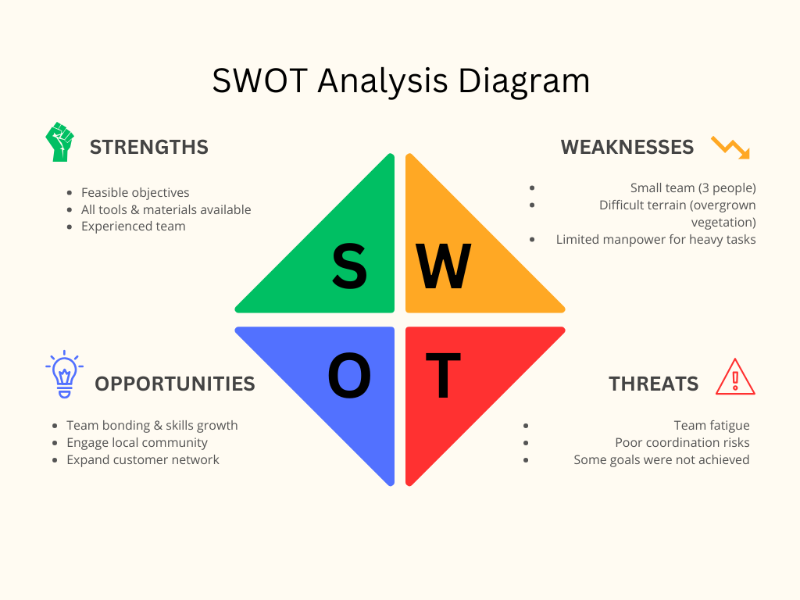

### 24-09-2025

## Today is September 24, 2025.

## Brief Description:
    I was involved in running 12C ADSS cable for a distance of 390m.
    Our goals were to run the overhead cable, provide 3 splice boxes (Closures), splice the cable straight, and finally pass a signal through the cable. 
    Some of the goals were achieved fully, others partially, and others weren't successful. Here is a Strengths, Weaknesses, Opportunities, and Threats (SWOT) Analysis.

## SWOT Analysis.
        1. Strengths.
  The Objectives were feasible; we had all the tools, materials, and an experienced team to do this work.
       
        2. Weaknesses.
  The team was small, composed of three individuals; we found it hard to navigate around the overgrown vegetation along the road reserve.
        
        3. Opportunities.
  It was a good opportunity for us as a team to bond, engage the local community, evangelise about the services we offer, and improve and expand our network to serve more customers.
        
        4. Threats.
  Tiresomeness comes with vices such as poor coordination among the team members. Some of the goals end up never being met.
  

## Summary.
    The tasks were well done, with the overhead cable running, 1 enclosure box installed, and straight splices made at two points.

## Parting short.
    How do you utilize fully your skills and knowledge?
